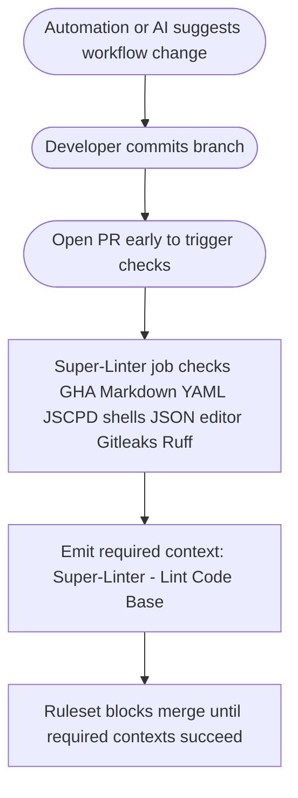

# Automation-Authored Workflow Changes vs Ruleset Enforcement

## Purpose

- Explain how automation- or AI-edited GitHub Actions workflows (Copilot, Cursor, etc.) interact with the main branch ruleset and required status contexts.
- Provide reviewer guidance, compliant patterns, and a fast visual of the CI flow including the sub-tests inside the core workflows.

## Required contexts (main branch)

- `Super-Linter / Lint Code Base` — workflow: `.github/workflows/super-linter.yml`, job: `Lint Code Base`.
- Context names are ruleset-bound; do not rename workflow `name:` or job `name:` without updating the ruleset export (`docs/ci/github-rulesets/main-ruleset.jsonc`).
- Required workflows must emit their contexts on every PR; avoid `paths` filters or job-level `if:` guards that skip required contexts.

## How the core workflows behave (sub-tests included)

### Super-Linter

- Always runs on `pull_request`, `push`, and `merge_group` to `main`.
- Job: `Lint Code Base`.
- Sub-tests (env toggles):
  - GitHub Actions lint
  - Markdown lint
  - YAML lint
  - JSCPD duplication scan
  - Bash + shfmt
  - PowerShell
  - JSON + JSONC
  - EditorConfig
  - Gitleaks
  - Python (Ruff)
- Final step: `./.github/actions/report-status-context` emits required context `Super-Linter / Lint Code Base`.

## Flow (Mermaid)



## Compliant patterns

- Keep required workflow/job names stable and retain the `report-status-context` step that emits the expected context string.
- For path-sensitive work, gate expensive steps behind a fast decision script while still emitting the required context on every PR.
- Example (required-safe pattern for a path-sensitive job):

```yaml
jobs:
  lint:
    name: Lint Code Base
    steps:
      - uses: actions/checkout@v6
      - name: Decide run
        id: decide
        run: echo "should_run=true" >> "$GITHUB_OUTPUT"
      - name: Heavy lint
        if: ${{ steps.decide.outputs.should_run == 'true' }}
        run: ./do-heavy-work.sh
      - name: Report required status context
        if: ${{ always() }}
        uses: ./.github/actions/report-status-context
        with:
          github-token: ${{ secrets.GITHUB_TOKEN }}
          pr-number: ${{ github.event.pull_request.number }}
          job-status: ${{ job.status }}
          status-context: Super-Linter / Lint Code Base
          target-url: ${{ github.server_url }}/${{ github.repository }}/actions/runs/${{ github.run_id }}
```

## Non-compliant patterns (reject these)

- Renaming required workflow or job names (breaks ruleset context match).
- Removing the `report-status-context` step or changing its `status-context` string.
- Adding `paths` or `if:` filters that prevent required contexts from emitting on some PRs.
- Introducing curl|bash or wget|sh install patterns in workflows (security violation).

## Reviewer checklist

- Required contexts still read exactly as documented above.
- `report-status-context` step present with the expected context names.
- No new path filters or job-level conditionals on required contexts.
- No curl|bash or wget|sh install patterns added.
- Links to ruleset reference remain valid: `docs/ci/github-rulesets/main-ruleset.jsonc`.
