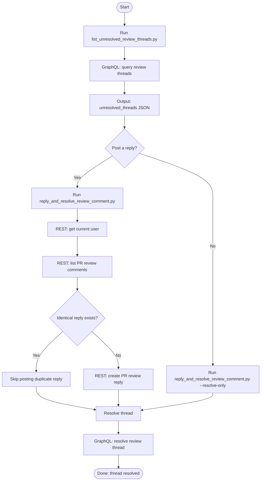
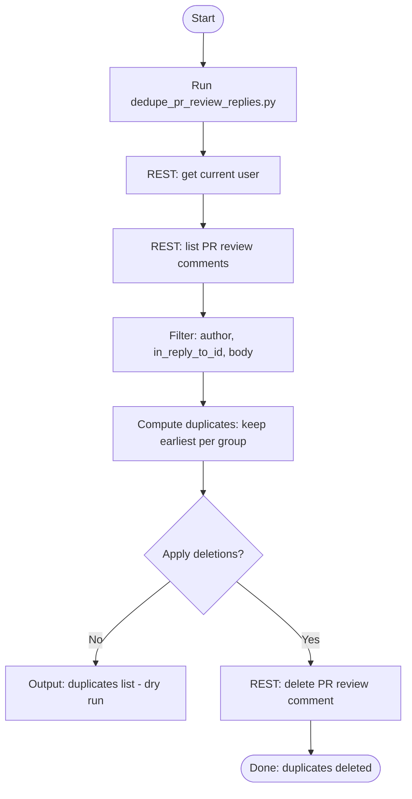
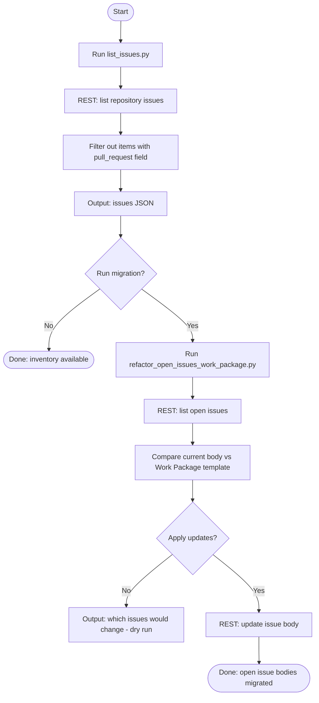

# GitHub CLI automation scripts

Purpose: small, predictable wrappers around `gh` that minimize endpoint trial/error and produce stable JSON outputs.

## Quick Reference (for AI agents)

Use these helpers for ALL GitHub API operations. NEVER construct raw `gh` commands manually.

**Most-used helpers**:

- `pr_upsert` — create/update PRs (supports `--auto-summary` for commit-based body)
- `pr_auto_summary` — generate PR body sections from branch commits
- `pr_close` — close PRs with optional comment and branch delete
- `issue_upsert` — create/update issues
- `issue_fetch` — fetch a single issue (shared function for single-issue data)
- `issue_close` — close issues with optional comment and close reason
- `triage_review_comments` — list, reply, and resolve review comments in one flow
- `list_unresolved_review_threads` — find unresolved PR review threads
- `reply_and_resolve_review_comment` — post reply and resolve thread
- `fix_unsigned_commits` — re-sign unsigned commits via interactive rebase
- `create_pr_review` — create a PR review with inline comments (single atomic API call)
- `dedupe_pr_review_replies` — remove duplicate automation replies
- `list_pr_review_comments_filtered` — filter PR review comments by author/path/text
- `pr_sync_issue_links` — normalize Closes/Relates links in PR bodies
- `delete_branch` — delete a remote branch
- `gh_api_call` — call common `gh api` endpoints with structured output
- `sonarcloud_issues` — pull SonarCloud findings and duplication metrics

**Run as modules** from repo root: `python -m scripts.github.<module>`

All helpers accept `--repo owner/name` and emit stable JSON outputs. See sections below for detailed examples.

## Conventions

- All scripts accept explicit `--repo owner/name` where applicable.
- Scripts that read the current repo/PR do so via `gh repo view` and `gh pr view`.
- All scripts avoid shell invocation by passing argv arrays.

## Debugging gh failures (stdout/stderr)

By default, these helpers keep output minimal.

If a `gh` command fails and you need the underlying API/GraphQL error, enable diagnostics for all GitHub helper scripts by setting:

```bash
export GH_HELPERS_DEBUG=1
```

With diagnostics enabled, the scripts will print the failing `gh` argv, return code, and captured `stdout`/`stderr` for any failed `gh` invocation.

Output is clipped by default to avoid flooding logs. To adjust:

```bash
export GH_HELPERS_DEBUG_MAX_CHARS=200000
```

To disable clipping:

```bash
export GH_HELPERS_DEBUG_MAX_CHARS=none
```

## How to run

Always run these helpers as modules from the repository root:

```bash
.venv/bin/python -m scripts.github.<module> ...

# Fallback when a venv is not available:
python3 -m scripts.github.<module> ...
```

Note: Use `python3` (not `python`) when a venv is not available, as `python` may not be installed or may not point to Python 3 on some Linux distributions.

Do not run files directly (e.g., `python scripts/github/<file>.py`). This breaks imports because the package root is not on `sys.path`.

## Scripts

## Workflows (Mermaid)

These diagrams show common helper workflows and explicitly label whether each step uses:

- REST API via `gh api` (default for most helpers)
- GraphQL via `gh api graphql` (used for PR review threads)

### Workflow: PR review threads (list → reply → resolve)

Outcome: identify unresolved review threads, optionally post a reply, then resolve the thread.



### Workflow: PR review reply dedupe (remove newest duplicates)

Outcome: delete duplicate replies created by automation, keeping the earliest reply per (parent comment + body) group.



## Listing PR review comments (generic)

Use this when you need a list of PR review comments to reply/resolve, regardless of author.

Module:

- `scripts.github.list_pr_review_comments_filtered`

Common filters:

- `--author-substring`: case-insensitive substring match (e.g., `copilot`, `cursor`)
- `--contains`: case-insensitive substring match in body
- `--path`: exact file path match

Examples:

```bash
python -m scripts.github.list_pr_review_comments_filtered --repo owner/name --pr 123
python -m scripts.github.list_pr_review_comments_filtered --repo owner/name --pr 123 --author-substring cursor
python -m scripts.github.list_pr_review_comments_filtered --repo owner/name --pr 123 --contains "hardcoded path"
```

### Workflow: Issue listing and Work Package migration

Outcome: list issues (excluding PRs) and optionally rewrite open issue bodies to the Work Package template.



### List unresolved PR review threads

- File: `scripts/github/list_unresolved_review_threads.py`

```bash
.venv/bin/python -m scripts.github.list_unresolved_review_threads --repo owner/name --pr 123
```

Filter to a specific thread (path/line/text) and fail unless exactly one matches:

```bash
.venv/bin/python -m scripts.github.list_unresolved_review_threads --repo owner/name --pr 123 \
  --path docker-compose.yml --line 46 --contains allowfrom --require-one
```

Output: JSON array of unresolved threads with `thread_id`, `path`, `line`, and per-comment `database_id`.

### Reply to a PR review comment and resolve the thread

- File: `scripts/github/reply_and_resolve_review_comment.py`

```bash
.venv/bin/python -m scripts.github.reply_and_resolve_review_comment --repo owner/name --comment-id 123456 --body "Fixed."
```

Resolve a thread without posting a reply (use this when a reply was already posted, to avoid double-posting):

```bash
.venv/bin/python -m scripts.github.reply_and_resolve_review_comment --repo owner/name --comment-id 123456 --resolve-only
```

Notes:

- `--comment-id` is the numeric PR review comment ID (REST).
- By default, the script looks up the comment `node_id` and PR number, posts a reply, then resolves the review thread via GraphQL.
- Use `--resolve-only` to skip replying and only resolve the thread.

### Dedupe duplicate PR review replies

- File: `scripts/github/dedupe_pr_review_replies.py`

Find duplicate replies (dry-run default):

```bash
.venv/bin/python -m scripts.github.dedupe_pr_review_replies --repo owner/name --pr 45
```

Delete duplicates (only deletes replies authored by the current `gh` user, and only when duplicates share the same `in_reply_to` + body):

```bash
.venv/bin/python -m scripts.github.dedupe_pr_review_replies --repo owner/name --pr 45 --apply
```

Notes:

- This operates on PR review comments (inline diff comments), not issue comments.
- Safe-by-default: without `--apply`, it will not delete anything.

### List issues (excluding PRs)

- File: `scripts/github/list_issues.py`

```bash
.venv/bin/python -m scripts.github.list_issues --repo owner/name --state open
```

Output: stable JSON with `count` and `issues[]` (includes `number`, `title`, `labels`, `assignees`).

### Refactor open issues to Work Package body

- File: `scripts/github/refactor_open_issues_work_package.py`

Dry-run (default):

```bash
.venv/bin/python -m scripts.github.refactor_open_issues_work_package --repo owner/name
```

Apply (replaces bodies of all open issues):

```bash
.venv/bin/python -m scripts.github.refactor_open_issues_work_package --repo owner/name --apply
```

Notes:

- This operation is destructive when run with `--apply`: it overwrites the full body of each affected open issue with the Work Package template, discarding any existing content.
- This script is intended to be run once as part of a migration to Work Packages, not as a recurring maintenance task.
- Before using `--apply`, review and/or back up existing issue content (for example by exporting issues).
- Always run the script in its default dry-run mode (without `--apply`) first to verify which issues will be affected.
- This script replaces issue bodies and does not modify labels.
- Closed issues are not modified.

### Create or edit an issue (upsert)

- File: `scripts/github/issue_upsert.py`

Create:

```bash
.venv/bin/python -m scripts.github.issue_upsert --repo owner/name --title "Title" --body "Body"
```

Edit:

```bash
.venv/bin/python -m scripts.github.issue_upsert --repo owner/name --number 123 --title "New title"
```

Incremental add (merge existing labels/assignees):

```bash
.venv/bin/python -m scripts.github.issue_upsert --repo owner/name --number 123 --label security --assignee alice --merge-existing
```

### Fetch a single issue

- File: `scripts/github/issue_fetch.py`

```bash
.venv/bin/python -m scripts.github.issue_fetch --repo owner/name --number 123
.venv/bin/python -m scripts.github.issue_fetch --repo owner/name --number 123 --json
```

Notes:

- Exposes `fetch_issue()` as the canonical shared function for single-issue
  data. Other helpers should import it rather than duplicating the GET call.
- `--json` emits structured output (repo, number, title, body, state, labels,
  assignees, milestone).

### Close an issue

- File: `scripts/github/issue_close.py`

```bash
.venv/bin/python -m scripts.github.issue_close --repo owner/name --number 123
.venv/bin/python -m scripts.github.issue_close --repo owner/name --number 123 --reason not_planned
.venv/bin/python -m scripts.github.issue_close --repo owner/name --number 123 --comment "Done."
.venv/bin/python -m scripts.github.issue_close --repo owner/name --number 123 --comment-file close_message.md
```

Notes:

- `--reason` defaults to `completed`. Valid values: `completed`, `not_planned`.
- If `--comment` or `--comment-file` is provided, the comment is posted before closing.
- Use `--json` for machine-readable output.

### Create or edit a pull request (upsert)

- File: `scripts/github/pr_upsert.py`

Create (REQUIRED — always use `--auto-summary`):

```bash
.venv/bin/python -m scripts.github.pr_upsert --repo owner/name --title "Title" --base main --head owner:branch \
  --auto-summary --issue 291
```

Edit (regenerate auto-summary sections, preserving manual content outside markers):

```bash
.venv/bin/python -m scripts.github.pr_upsert --repo owner/name --number 45 --auto-summary
```

Edit (metadata only):

```bash
.venv/bin/python -m scripts.github.pr_upsert --repo owner/name --number 45 --title "New title"
```

If a PR was created as a draft by other means, you can mark it ready-for-review:

```bash
.venv/bin/python -m scripts.github.pr_upsert --repo owner/name --number 45 --ready-for-review
```

Notes:

- `--auto-summary` is REQUIRED for PR creation. NEVER use `--body` or `--body-file`.
- `--auto-summary` parses `git log base..HEAD --oneline` and groups commits by conventional type into the Summary section.
- `--base-branch` overrides base branch detection (default: auto-detect `main` or `master`).
- `--issue N` (repeatable) adds `Closes #N` to the Linked Issues section.
- On edit (`--number`), only content between `<!-- auto-summary:start/end -->` markers is replaced; manually written content is preserved.

### Auto-generate PR summary from branch commits

- File: `scripts/github/pr_auto_summary.py`

Generate a full PR body from commits ahead of `main`:

```bash
.venv/bin/python -m scripts.github.pr_auto_summary
```

Specify base branch and linked issues:

```bash
.venv/bin/python -m scripts.github.pr_auto_summary --base main --issue 291
```

Output structured JSON:

```bash
.venv/bin/python -m scripts.github.pr_auto_summary --json
```

Write output to a file:

```bash
.venv/bin/python -m scripts.github.pr_auto_summary --output pr-body.md
```

Notes:

- Parses `git log base..HEAD --oneline` and groups commits by conventional type (feat, fix, docs, etc.).
- Dependabot "Bump..." commits are grouped under Dependencies.
- Non-conventional commits are grouped under Other.
- Output aligns with the repository's PR template (Summary, Dependencies, Linked issues).
- Auto-generated sections are wrapped in `<!-- auto-summary:start/end -->` markers for safe regeneration.
- Typically used via `pr_upsert --auto-summary` rather than standalone.

### PR overview

- File: `scripts/github/pr_overview.py`

```bash
.venv/bin/python -m scripts.github.pr_overview --repo owner/name --pr 45
```

### Close a pull request

- File: `scripts/github/pr_close.py`

```bash
.venv/bin/python -m scripts.github.pr_close --repo owner/name --pr 123
.venv/bin/python -m scripts.github.pr_close --repo owner/name --pr 123 --comment "Closing because..."
.venv/bin/python -m scripts.github.pr_close --repo owner/name --pr 123 --delete-branch
```

Notes:

- If `--comment` is provided, the comment is posted before closing.
- Use `--delete-branch` to delete the head branch after closing.
- Use `--json` for machine-readable output.

### Triage PR review comments (flow script)

- File: `scripts/github/triage_review_comments.py`

List comments matching filters (no replies):

```bash
.venv/bin/python -m scripts.github.triage_review_comments --repo owner/name --pr 123
.venv/bin/python -m scripts.github.triage_review_comments --repo owner/name --pr 123 --author-substring copilot
```

Reply and resolve in one command:

```bash
.venv/bin/python -m scripts.github.triage_review_comments --repo owner/name --pr 123 \
  --author-substring copilot \
  --replies-json '[{"comment_id": 456, "body": "Fixed in commit abc123."}]'
```

Notes:

- Without `--replies-json`, lists filtered comments (read-only).
- With `--replies-json`, posts replies and resolves threads for each specified comment.
- Consolidates the list-reply-resolve flow into 1-2 invocations instead of N+1.
- Individual helpers (`list_pr_review_comments_filtered`, `reply_and_resolve_review_comment`) remain available for troubleshooting.

### Create a PR review (atomic)

- File: `scripts/github/create_pr_review.py`

Dry-run (default — shows what would be submitted):

```bash
.venv/bin/python -m scripts.github.create_pr_review \
  --repo owner/name --pr 42 \
  --body "Looks good" --event APPROVE
```

Submit the review:

```bash
.venv/bin/python -m scripts.github.create_pr_review \
  --repo owner/name --pr 42 \
  --body "Review summary" --event COMMENT \
  --comments-json '[{"path": "file.py", "line": 10, "body": "Fix this"}]' \
  --apply
```

Load inline comments from a file:

```bash
.venv/bin/python -m scripts.github.create_pr_review \
  --repo owner/name --pr 42 --event COMMENT \
  --comments-file review-comments.json --apply
```

Notes:

- Safe-by-default: without `--apply`, no API call is made.
- Creates the review in a single atomic `POST /pulls/{pr}/reviews` call, avoiding the two-step PENDING-then-submit pattern that causes duplicate review threads.
- Supported events: `COMMENT`, `APPROVE`, `REQUEST_CHANGES`.
- At least one of `--body` or `--comments-json`/`--comments-file` is required.
- Use `--json` for machine-readable output.

### Sync PR issue links

- File: `scripts/github/pr_sync_issue_links.py`

```bash
.venv/bin/python -m scripts.github.pr_sync_issue_links --repo owner/name --pr 123 --close 456
.venv/bin/python -m scripts.github.pr_sync_issue_links --repo owner/name --pr 123 --relate 789
```

Notes:

- Normalizes `Closes #...` and `Relates to #...` lines in PR bodies.
- Use `--dry-run` to preview changes without modifying the PR.

### Delete a remote branch

- File: `scripts/github/delete_branch.py`

```bash
.venv/bin/python -m scripts.github.delete_branch --repo owner/name --branch feature/123-example
```

### Download GitHub Actions run logs

- File: `scripts/github/action_run_logs.py`

```bash
.venv/bin/python -m scripts.github.action_run_logs \
  --repo owner/name \
  --run-id 123
.venv/bin/python -m scripts.github.action_run_logs \
  --repo owner/name \
  --run-id 123 \
  --job-name "Run pre-commit"
```

### Rulesets required contexts

- File: `scripts/github/list_rulesets_required_contexts.py`

```bash
.venv/bin/python -m scripts.github.list_rulesets_required_contexts --repo owner/name
```

### Diff required vs present status contexts

- File: `scripts/github/diff_required_status_contexts.py`

```bash
.venv/bin/python -m scripts.github.diff_required_status_contexts --repo owner/name --pr 45
```

Notes:

- Uses commit status contexts (`/commits/{sha}/status`) to match GitHub "required status checks" context strings.

### List PR review comments

- File: `scripts/github/list_pr_review_comments.py`

```bash
.venv/bin/python -m scripts.github.list_pr_review_comments --repo owner/name --pr 45
```

### List PR commit signature verification

- File: `scripts/github/list_pr_commit_verifications.py`

```bash
.venv/bin/python -m scripts.github.list_pr_commit_verifications --repo owner/name --pr 45
```

Only include commits where GitHub verification is not `true`:

```bash
.venv/bin/python -m scripts.github.list_pr_commit_verifications --repo owner/name --pr 45 --only-failing
```

Fail (exit code 2) if any commit matches specific failure reasons:

```bash
.venv/bin/python -m scripts.github.list_pr_commit_verifications --repo owner/name --pr 45 --fail-on unsigned,no_user
```

### List Copilot PR review comments (compatibility wrapper)

- File: `scripts/github/list_copilot_review_comments.py`

```bash
.venv/bin/python -m scripts.github.list_copilot_review_comments --repo owner/name --pr 45
```

This is a compatibility wrapper around `list_pr_review_comments_filtered.py` that defaults `--author-substring copilot`.

Prefer `list_pr_review_comments_filtered.py` for non-Copilot authors (Cursor, humans) and for additional filters.

### List SSH signing keys for the authenticated gh user

- File: `scripts/github/list_ssh_signing_keys.py`

```bash
.venv/bin/python -m scripts.github.list_ssh_signing_keys
.venv/bin/python -m scripts.github.list_ssh_signing_keys --redact
```

### Fix unsigned commits in a pull request

- File: `scripts/github/fix_unsigned_commits.py`

Fix unsigned commits by re-signing them via interactive rebase. Safe-by-default (dry-run unless `--apply` is used).

Dry-run (check what would be fixed):

```bash
.venv/bin/python -m scripts.github.fix_unsigned_commits --pr 104
```

Apply fixes (rebase and force-push):

```bash
.venv/bin/python -m scripts.github.fix_unsigned_commits --pr 104 --apply
```

Output results as JSON:

```bash
.venv/bin/python -m scripts.github.fix_unsigned_commits --pr 104 --json
```

Notes:

- Requires the PR branch to be checked out locally
- Verifies git commit signing is configured before attempting fixes
- Uses `--force-with-lease` for safe force-pushing
- Default is dry-run mode; `--apply` flag required to make changes
- See `docs/automation/runbooks/fix-unsigned-commits-in-pr.md` for detailed procedure

**If signing is not configured**, the script will provide setup guidance. Use:

```bash
.venv/bin/python -m scripts.devops.setup_git_signing
```

### Test PR comment thread access

- File: `scripts/github/test_pr_comment_access.py`

Test access to PR comment threads from the current device (read-only by default):

```bash
.venv/bin/python -m scripts.github.test_pr_comment_access --pr 104
```

Test write operations (post a reply):

```bash
.venv/bin/python -m scripts.github.test_pr_comment_access --pr 104 --test-write
```

Use a specific comment ID:

```bash
.venv/bin/python -m scripts.github.test_pr_comment_access --pr 104 --comment-id 2688082265
```

Output results as JSON:

```bash
.venv/bin/python -m scripts.github.test_pr_comment_access --pr 104 --json
```

Notes:

- This script verifies authentication, ability to list comments, fetch comment context, and optionally post replies.
- By default, only read operations are tested. Use `--test-write` to test posting replies.
- The script is cross-platform compatible (Windows and Linux).

### Call common API endpoints (safe wrapper)

- File: `scripts/github/gh_api_call.py`

```bash
.venv/bin/python -m scripts.github.gh_api_call --repo owner/name --op issue --number 123
.venv/bin/python -m scripts.github.gh_api_call --repo owner/name --op pr --number 45
.venv/bin/python -m scripts.github.gh_api_call --repo owner/name --op commit-status --sha abcdef0
.venv/bin/python -m scripts.github.gh_api_call --repo owner/name --op check-runs --sha abcdef0
```

Supported `--op` values: `issue`, `pr`, `pr-comment`, `ruleset`, `commit-status`, `check-runs`, `check-run-annotations`.

Notes:

- Endpoints are selected from a fixed allowlist; arbitrary paths are not supported.
- Output includes the exact `gh` argv executed and the parsed JSON response.

### Pull SonarCloud findings and duplication metrics

- File: `scripts/github/sonarcloud_issues.py`

Requires: `SONAR_TOKEN` environment variable (SonarCloud user token).

**Preferred access mode**: use the 1Password CLI (`op`) to inject the token at runtime:

```bash
op signin                  # authenticate once per session
op run --env-file=.env -- .venv/bin/python -m scripts.github.sonarcloud_issues
```

#### Issues mode (default)

List all open issues:

```bash
SONAR_TOKEN=your_token .venv/bin/python -m scripts.github.sonarcloud_issues
```

Filter by type and severity:

```bash
SONAR_TOKEN=your_token .venv/bin/python -m scripts.github.sonarcloud_issues \
  --types BUG,VULNERABILITY --severities CRITICAL,BLOCKER
```

Scope to a specific branch or PR:

```bash
SONAR_TOKEN=your_token .venv/bin/python -m scripts.github.sonarcloud_issues --branch main
SONAR_TOKEN=your_token .venv/bin/python -m scripts.github.sonarcloud_issues --pull-request 123
```

Human-readable Markdown table:

```bash
SONAR_TOKEN=your_token .venv/bin/python -m scripts.github.sonarcloud_issues --format summary
```

#### Duplications mode

Pass `--duplications` to query duplication metrics instead of issues. Fetches
project-level metrics and per-file duplication density. Add `--block-details`
to include block-level detail (one API call per duplicated file).

Project-wide duplication metrics as JSON:

```bash
SONAR_TOKEN=your_token .venv/bin/python -m scripts.github.sonarcloud_issues --duplications
```

Human-readable Markdown summary:

```bash
SONAR_TOKEN=your_token .venv/bin/python -m scripts.github.sonarcloud_issues \
  --duplications --format summary
```

PR-scoped duplication analysis (includes `new_*` metrics):

```bash
SONAR_TOKEN=your_token .venv/bin/python -m scripts.github.sonarcloud_issues \
  --duplications --pull-request 123 --format summary
```

With block-level detail (shows exact line ranges of each duplication group):

```bash
SONAR_TOKEN=your_token .venv/bin/python -m scripts.github.sonarcloud_issues \
  --duplications --block-details --format summary
```

#### Hotspots mode

Pass `--hotspots` to query security hotspots instead of issues. Uses the
`/api/hotspots/search` endpoint (separate from the issues API).

List all security hotspots as JSON:

```bash
SONAR_TOKEN=your_token .venv/bin/python -m scripts.github.sonarcloud_issues --hotspots
```

Human-readable Markdown summary:

```bash
SONAR_TOKEN=your_token .venv/bin/python -m scripts.github.sonarcloud_issues \
  --hotspots --format summary
```

Filter by status or resolution:

```bash
SONAR_TOKEN=your_token .venv/bin/python -m scripts.github.sonarcloud_issues \
  --hotspots --hotspot-statuses TO_REVIEW
SONAR_TOKEN=your_token .venv/bin/python -m scripts.github.sonarcloud_issues \
  --hotspots --hotspot-resolution SAFE
```

PR-scoped hotspots:

```bash
SONAR_TOKEN=your_token .venv/bin/python -m scripts.github.sonarcloud_issues \
  --hotspots --pull-request 123 --format summary
```

#### Notes

- The project key defaults to `sonar.projectKey` from `sonar-project.properties` (auto-detected).
- Override with `--project-key` if needed.
- Output formats: `json` (default, machine-readable) or `summary` (Markdown table).
- Issues, duplications, and hotspots modes are mutually exclusive; use one flag per invocation.
- `--block-details` requires `--duplications`; triggers one API call per duplicated file.
- `--hotspot-statuses` and `--hotspot-resolution` require `--hotspots`.
